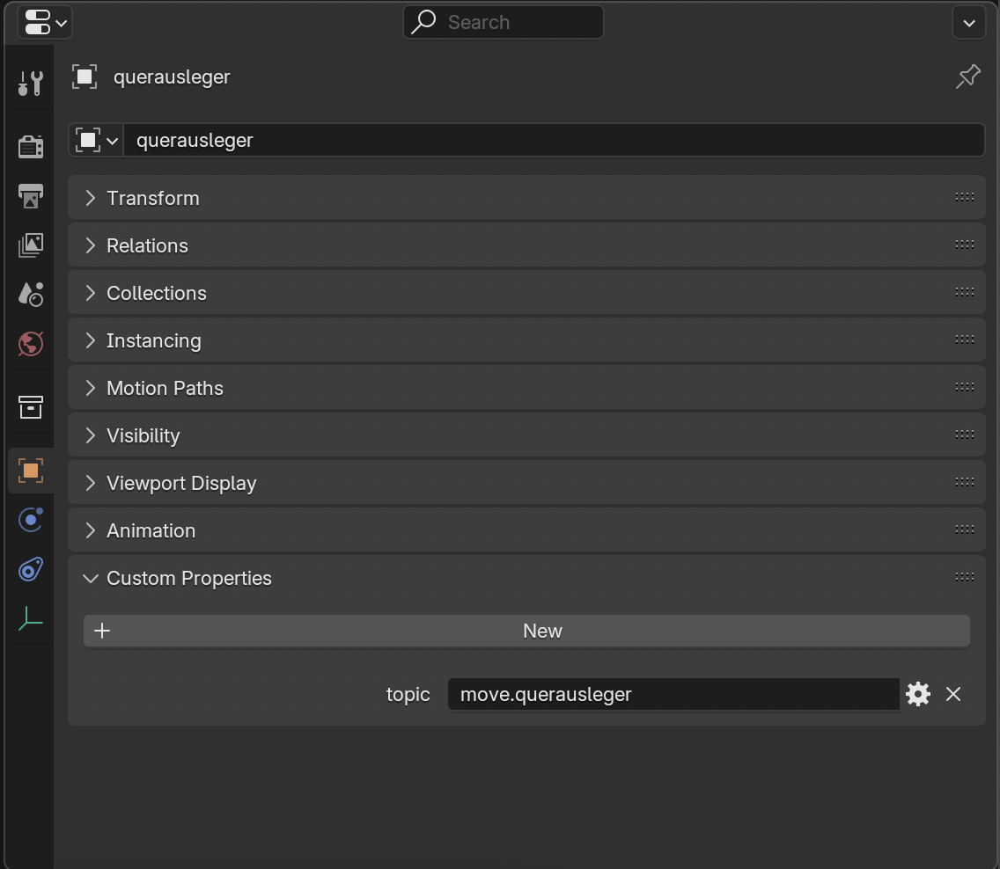
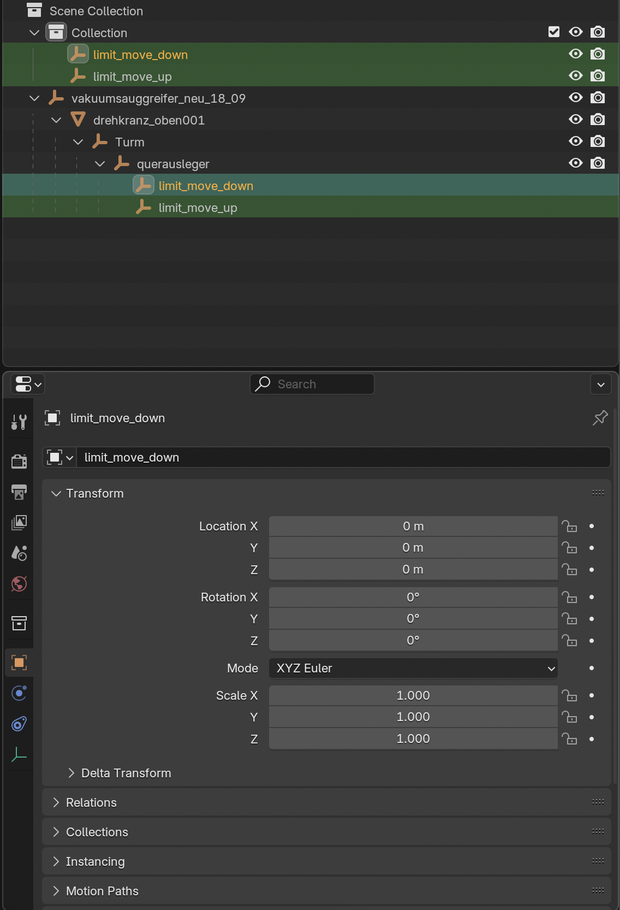
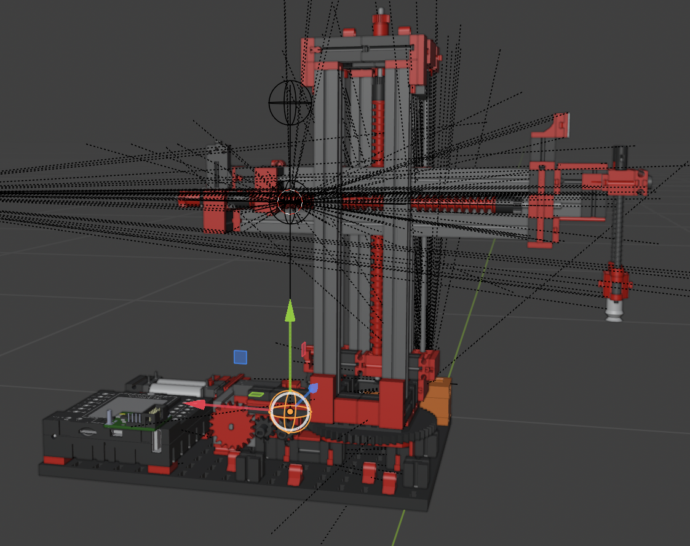
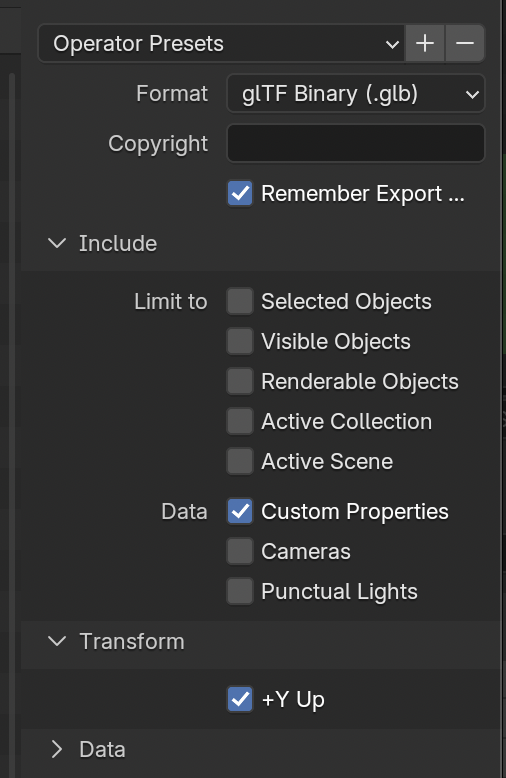

# Creating Models

# Conversion

KeepMeAlive3D currently only works with .GLB files.
Since not every model is available in this format, a conversion may be necessary.
While Blender supports many import formats, not all are covered.
If you need to convert a .STEP file, you can use the FreeCAD application.

# Blender

To use the full potential of the application, the models need to be annotated with custom annotations.
The following is a step-by-step guide on how to do this.

## Topics

In order to display the data graphs of parts, components in the sidebar, and animations, the appropriate MQTT topics are
required.

1) Select the component in Blender by clicking on it.
2) In the sidebar select the object properties icon (orange square).
3) Open the dropdown 'Custom Properties'.
4) Click new and add the name in following format:
    * If the object has moving animations use the prefix 'move.' and append the object name.
    * If the object has rotation animations do the same with the prefix 'rot.'
    * If there are no animations: use the normal topic.

The result should look like in the image below:

## Animations

To add animations the step 'Topics' is required first. Then proceed as follows:
Do the following steps two times:

1) In Blender click 'Layout', 'Add', 'Empty', 'Sphere'. Adjust the radius of the sphere as needed.
2) Name the first empty 'limit_move_up' and the second 'limit_move_down'.
3) Select one and the object that will have the animations in the end.
    * Press Command + P and select the option 'Object (Without Inverse)'.
      This will make the empty a child and move it to the position of the parent. The relative coordinates will be 0.

4) Now the empties can be moved to represent the upper and lower bounds of the object's animation.
   See the example below where the bounds for the cross arm (querausleger) are visible.
   Remember that Blender's native space is Z-up, right-handed, and Three.js's native space is Y-up, also right-handed.

The same can be done with rotated empties for the rotation bounds.
Name these 'limit_rot_max' and 'limit_rot_min'.
However, currently an object can only have one pair of empties, so it can have either rotations or moving animations.

## Export

When exporting the model from Blender, make sure the following options are selected:

In particular the Custom Properties have to be included as they contain the topics.
Also, the +Y UP transformation has to be performed due to the different coordinate systems.

# Import

The model can be imported in the KeepMeAlive3D UI on 'Model', 'Upload'.

# Implementation Details

## Workflow

The frontend handles animations as follows:
In `DynamicModel` the empties are pulled up in the object hierarchy. The user models them in Blender as children of the
object to be animated.
While this is convenient to do in Blender, it creates some problems when processing them.
When the object is moved/rotated, the empties are also moved/rotated (as they are children). So the positions change.
Saving the global positions at the start is not an option as another parent might be annotated and change the positions.
The implemented solution is to drag the empties to the same level as their parents. If another parent is moved, the
empties will move with it and still the positions can be used to animate the target object as they do not move with the
target.
The `Animator` component listens for incoming animation events. As soon as an event arrives, the new target position is
calculated in `LimitUtils`.
Finally, the target object is lerped to the target position. To ensure smooth animations, this is done frame by frame.

## Dev Hints

* To facilitate debugging in /src/debug, a custom frontend `Publisher` component can be found.
  It allows you to emulate moving and rotating events in the frontend (no need for a mqtt publisher).
  Use it by changing the return value in the `Animator` component to `return Publisher(animationCallback);`.
  The publisher will call the animation callback directly. The topics must be set manually.

* Coordinates are slightly off in ThreeJS. This can cause problems when rotating or moving objects.
  The implemented workaround is to round the quaternions to the fourth digit. This can cause problems with very small
  objects.
  It was not possible to determine where the offsets were coming from, but this could potentially solve the problem.

### Access custom properties in external applications

While the custom properties are stored in .blend files and can be parsed, it is more convenient to export the file as a
to export the file as .glb and use a GLB parser. The custom properties are stored in
with each object. They can be accessed using `node.userData["topic"]`.