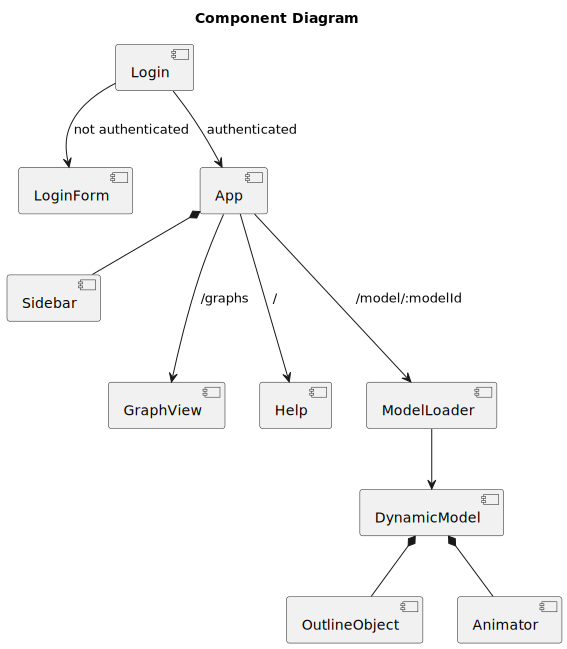

# Frontend Components

This page explains the frontend components using a component diagram.

## Login
The login is displayed as the first component to prevent access to the UI without a login.
If the key is present in the local storage, the application is displayed next, otherwise a login interface is displayed.

## Sidebar
The sidebar contains links to all the features. Of note is the ModelPartsGroup. It displays a list of the components of
the model annotated with the custom property 'topic'.
Click to highlight the component.

## App

This component is mainly used for routing. There are three different routes.
`/graphs` leads to the graph view. Help` shows a help text on how to open a model.
`/model/:modelId` shows the ModelLoader which loads the model with the given modelId.

## DynamicModel

Once a model is loaded into the ModelLoader, it is displayed in a ThreeJS canvas.
The logic for outlining objects (`OutlineObject`) and animations (`Animator`) is also included.