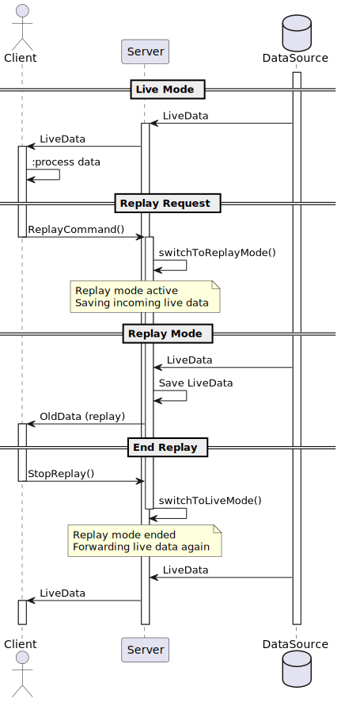

# Sessions and Replay

The replay mode can be used to review the events of a specific time period.

## Sessions

Each client has its own session for its websockets. This allows the backend to distinguish between
the client. The session is determined by a UUID sent by the client in each message manifest.
On the client side, the UUID is stored in local storage, and if it does not exist, a new one is created.
When a message is sent, the server opens a new session for the client. As long as at least one
websocket is open, the session remains alive. Otherwise it will be closed by the server, but can be
reopened by the client.

## Live mode and Replay mode

The backend distinguishes between replay and live mode for a session. See the sequence diagram for details.
By default the session is in live mode, i.e. live data is being sent to the Client.

When a Replay command is sent, the server switches to Replay mode. In Replay mode, live data is blocked so that
cannot be inferred from the replay. Data from the replay timeframe is delivered.

The backend ensures that the time between messages is the same as when they were first collected.
Once the replay has finished, the server switches back to live mode. From this point on, live data is delivered again.

Note that the new live data collected during a replay is stored but not delivered to the client even after the replay
has finished.